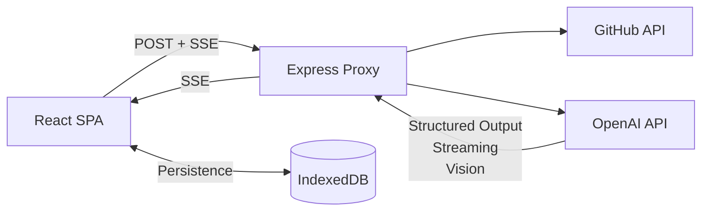

# Orbit 🛰️

> **Describe your project. Give Orbit your context. Get a board you can start working from in under a minute.**

Orbit is an **AI-powered project board** that turns a messy project brief into a structured, editable Kanban board.

Describe what you're building, attach your specs or screenshots, connect a public GitHub repository, and let AI analyze the context to generate a draft board — complete with states, tasks, priorities, labels, estimates, and relationships.

You review the generated work, make changes, and then commit it to your board.

> **AI proposes. Humans confirm.**

---

## 🧠 AI Stack

Orbit uses **OpenAI models and APIs** as its AI layer.

The AI architecture is intentionally model-driven but provider-specific implementation is isolated inside the proxy. This keeps the rest of the application independent from the AI provider.

### AI capabilities

* **Structured outputs** for predictable board generation
* **Tool/function calling** for `create_board` and `propose_changes`
* **Streaming responses** for incremental board generation
* **Vision** for analyzing screenshots
* **Context-aware planning** using project descriptions, files, GitHub repositories, and issues
* **JSON schema validation** with Zod before changes reach the application state

The AI never directly mutates the board.

Instead:

```text
User Context
     │
     ▼
OpenAI
     │
     ▼
Structured AI Output
     │
     ▼
Validation
     │
     ▼
Draft / Proposed Changes
     │
     ▼
User Review
     │
     ▼
Application
```

---

## 🤖 AI Board Generation

Orbit uses structured AI output rather than relying on free-form text.

The initial generation uses a `create_board` tool/function.

```text
create_board
```

The model produces:

```text
projectName
summary
states[]
items[]
```

Each work item can contain:

```text
id
title
description
stateId
priority
labels
estimate
parentId
source
```

The model is instructed to:

* Produce concrete work items
* Use available project context
* Avoid inventing unsupported functionality
* Include existing GitHub issues when relevant
* Break large pieces of work into parent items and sub-items
* Emit board states before work items

---

## 💬 AI Follow-up Changes

After the board is created, users can continue working with Orbit through the AI chat.

For example:

> "Add authentication tasks and move the API work into In Progress."

The AI does not return an entirely new board.

Instead, it returns structured changes:

```text
ADD
UPDATE
MOVE
DELETE
```

Each change contains a reason and is presented to the user before being applied.

```text
User
  │
  ▼
AI Chat
  │
  ▼
OpenAI
  │
  ▼
propose_changes
  │
  ▼
Validation
  │
  ▼
Review Changes
  │
  ├── Apply
  ├── Apply Selected
  └── Discard
```

---

# 🌊 AI Streaming Architecture

Orbit streams AI output directly into the UI.

```text
React
  │
  │ POST /generate
  ▼
Express Proxy
  │
  │ OpenAI API
  ▼
OpenAI
  │
  │ streaming structured output
  ▼
Express
  │
  │ SSE
  ▼
React
  │
  ▼
Partial JSON Parser
  │
  ▼
Zustand
  │
  ▼
Live Draft Board
```

The proxy forwards incremental AI output to the browser through **Server-Sent Events**.

The frontend parses the incomplete JSON stream and progressively renders valid states and work items.

This allows the user to see:

```text
Planning...
     ↓
Backlog
In Progress
Done
     ↓
Create authentication API
     ↓
Build login UI
     ↓
Add session handling
```

rather than waiting for the entire response to finish.

---

# 🔌 AI Provider Architecture

AI-specific code lives inside the proxy:

```text
apps/proxy/
└── src/
    ├── services/
    │   ├── openai.ts
    │   └── github.ts
    │
    ├── prompts/
    │   ├── create-board.ts
    │   └── propose-changes.ts
    │
    └── routes/
        ├── generate.ts
        └── propose.ts
```

The frontend never communicates directly with OpenAI.

This provides:

* API key protection
* Centralized prompts
* Centralized model configuration
* Rate limiting
* Request validation
* AI error handling
* Easier future model/provider changes

---

# 🧰 Tech Stack

| Layer               | Technology                                          |
| ------------------- | --------------------------------------------------- |
| Frontend            | React + Vite                                        |
| Language            | TypeScript                                          |
| Routing             | TanStack Router                                     |
| State               | Zustand                                             |
| Data Fetching       | TanStack Query                                      |
| Styling             | Tailwind CSS                                        |
| Drag & Drop         | dnd-kit                                             |
| Rich Text           | Tiptap                                              |
| Command Palette     | cmdk                                                |
| Persistence         | IndexedDB + Dexie                                   |
| Backend             | Node.js + Express                                   |
| Validation          | Zod                                                 |
| AI Platform         | OpenAI API                                          |
| AI SDK              | OpenAI SDK                                          |
| AI Capabilities     | Structured Outputs, Tool Calling, Streaming, Vision |
| Repository Context  | GitHub REST API                                     |
| Streaming Transport | Server-Sent Events                                  |
| Testing             | Vitest, Testing Library, Playwright                 |
| Accessibility       | axe-core                                            |
| Package Manager     | pnpm                                                |
| Monorepo            | Turborepo                                           |

---

# ⚙️ Environment Variables

The proxy requires:

```env
OPENAI_API_KEY=
OPENAI_MODEL=
GITHUB_TOKEN=
ALLOWED_ORIGIN=
```

### Example

```env
OPENAI_API_KEY=your_openai_api_key
OPENAI_MODEL=your_model
GITHUB_TOKEN=your_github_token
ALLOWED_ORIGIN=http://localhost:5173
```

The OpenAI API key is only available to the server-side proxy and is never exposed to the browser.

---

# 🏗️ Architecture



The application remains client-heavy:

```text
Browser
├── UI
├── Board engine
├── Zustand state
├── Partial JSON parser
├── IndexedDB
├── PDF extraction
└── User interactions

Proxy
├── OpenAI
├── GitHub
├── Prompt management
├── Validation
├── Rate limiting
└── SSE streaming
```

---

# 🔐 AI Security

OpenAI credentials are never shipped to the frontend.

The proxy is responsible for:

* Keeping `OPENAI_API_KEY` server-side
* Validating requests with Zod
* Limiting request payload size
* Rate limiting AI requests
* Restricting CORS
* Validating structured AI output
* Treating GitHub repository content as untrusted input

AI-generated content is rendered as text or through Tiptap rather than using unsafe HTML injection.

---

# 🚀 Getting Started

## Prerequisites

* Node.js
* pnpm
* Git
* OpenAI API key
* Optional GitHub token

Clone the repository:

```bash
git clone https://github.com/<your-username>/orbit.git

cd orbit
```

Install dependencies:

```bash
pnpm install
```

Create your environment file:

```bash
cp .env.example .env
```

Configure:

```env
OPENAI_API_KEY=
OPENAI_MODEL=
GITHUB_TOKEN=
ALLOWED_ORIGIN=
```

Start the development environment:

```bash
pnpm dev
```

---

# 🔮 Future AI Architecture

The initial version focuses on AI-assisted project planning.

The architecture leaves room for more capable AI workflows later:

```text
                    Orbit
                      │
          ┌───────────┴───────────┐
          │                       │
       Planning                Execution
          │                       │
    ┌─────┴─────┐          ┌──────┴──────┐
    │            │          │             │
Product Agent  Research    Coding Agent  QA Agent
    │            │          │             │
    └────────────┴──────────┴─────────────┘
                      │
                 Project Board
```

Potential future capabilities include:

* AI project planning
* AI task decomposition
* AI research agents
* AI coding agents
* Automated progress updates
* Agent-to-agent workflows
* GitHub pull-request workflows
* Automated project health monitoring

These are future directions rather than requirements for the current implementation.

---

# 🛰️ Philosophy

Orbit is built around a simple interaction model:

> **Give AI the context. Let it propose the work. Keep humans in control.**

The goal isn't to replace the project board with a chatbot.

The goal is to make the board **intelligent enough to understand the project it represents.**

---

<div align="center">

**Orbit 🛰️**

*Turn project context into work.*

</div>
